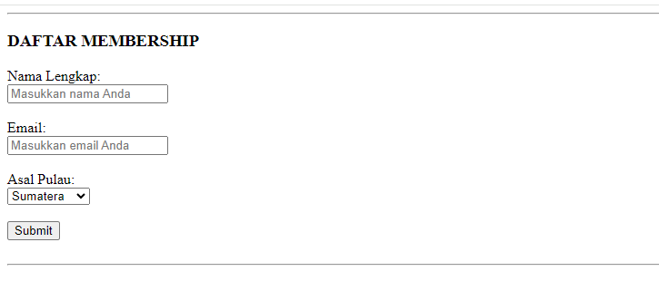

# ASSIGNMENT 1
Kami berkeinginan untuk membangun sebuah platform pembelajaran berbasis website dengan memberi akses belajar untuk seluruh jenjang sekolah, baik sekolah dasar hingga sekolah menengah. Di platform ini, pengguna dapat menikmati berbagai materi, video dan soal-soal pembelajaran.

## PLATFORM: KAMAR BELAJAR YO


## Mekanisme Pelayanan
```dash
Kami Menyediakan 2 Opsi pelayanan yaitu: 
gratis dan berbayar
```

### 1. Gratis
Kami percaya bahwa pendidikan adalah hak semua orang. Oleh karena itu, sebagian besar konten dasar di platform kami akan tersedia secara **gratis**. Pengguna bisa belajar tanpa dipungut biaya, mengakses video tutorial, artikel, latihan soal, dan materi-materi lainnya yang bermanfaat untuk membantu proses belajar


### 2. Membership Berbayar
Bagi mereka yang ingin mendalami lebih, kami menawarkan pembelajaran dengan akses fitur-fitur premium dengan opsi **membership berbayar**.
Pengguna yang mendaftar membership akan mendapatkan akses eksklusif ke konten-konten lanjutan, kelas online dengan mentor, sertifikat penyelesaian, dan fitur interaktif seperti konsultasi personal dengan pengajar, ujian khusus, serta latihan intensif.


### Keunggulan
|Gratis|Membership|
|---|---|
|Fitur terbatas | Fitur Premium |
|Tanpa Reward | Terdapat Reward Bulanan |

### Komentar dan Narahubung
Pada Bagian Footer kami telah menyediakan kolom komentar dan narahubung agar tidak ketinggalan informasi

#### TERIMA KASIH
