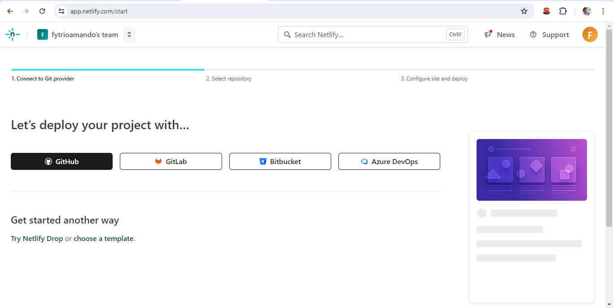
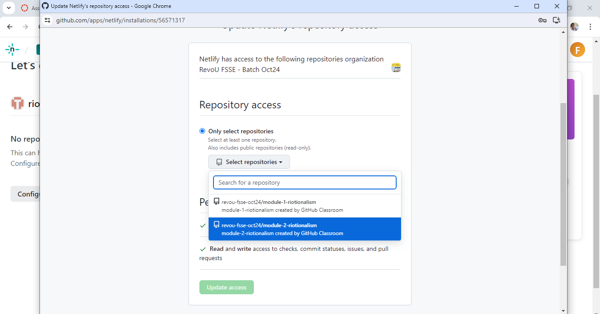
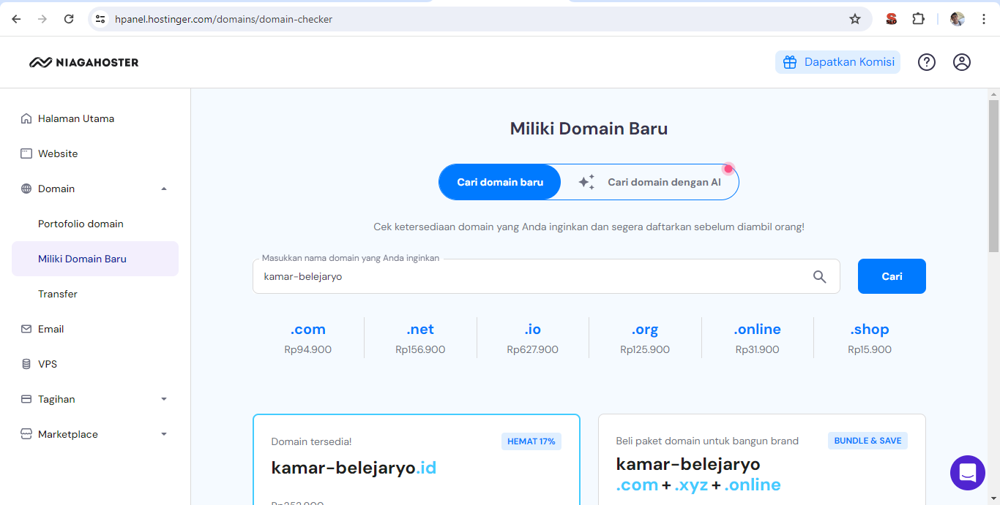
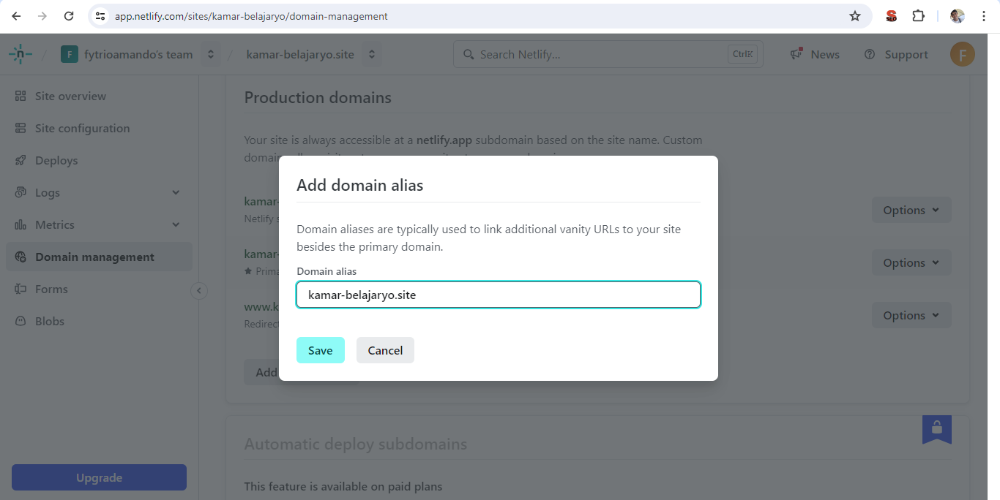
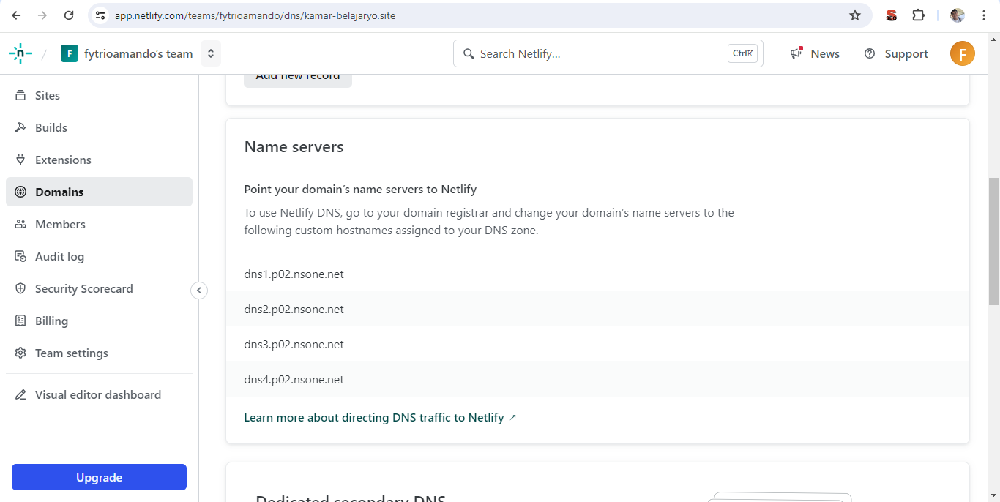
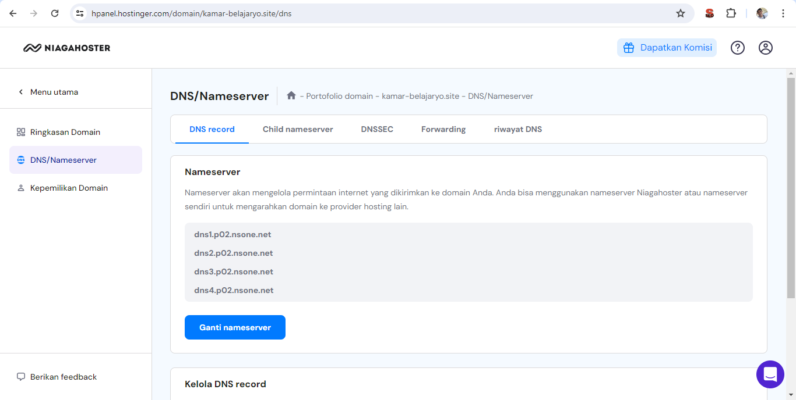
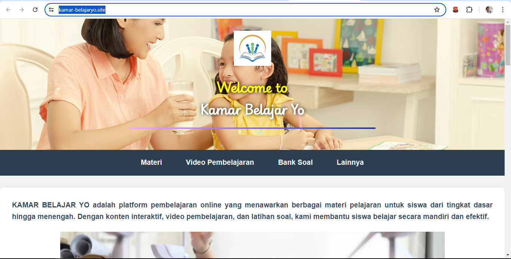

# ✅ MODULE 2 FINAL CHECKPOINT

|  | [click here!](https://kamar-belajaryo.site/) |
| --- | ---- |

# 💡 Netlify Sign up process & connect Netlify to Github project 🎉

## Buka Situs Netlify
1. Kunjungi Netlify.
2. Klik Tombol "Sign Up"
Pilih opsi "Sign up with GitHub" untuk mengintegrasikan/menghubungkan langsung dengan akun GitHub.
Masuk ke akun GitHub Anda dan berikan izin akses yang diminta oleh Netlify.

3. Lengkapi Detail Akun
Setelah login, isi informasi yang diminta seperti nama tim dan preferensi lainnya.

## 💡 Menghubungkan Netlify ke Proyek GitHub
1. Buka Dashboard Netlify
Setelah masuk, Anda akan diarahkan ke dashboard utama Netlify.

2. Pilih "New site from Git"
Klik tombol ini untuk memulai proses deployment dari repository GitHub Anda.

3. Pilih Platform GitHub
Anda akan diminta untuk memilih platform Git. Pilih GitHub.

4. Izinkan Netlify Mengakses Repository
Jika belum dilakukan, berikan akses ke Netlify untuk melihat repository Anda di GitHub.

5. Pilih Repository yang Ingin Dihubungkan
Pilih repository dari daftar yang ditampilkan.

6. Konfigurasi Build Settings
Tentukan branch mana yang akan digunakan untuk build. serta isi yang diperlukan

7. Klik "Deploy Site"
Netlify akan memulai proses build dan deployment.
Setelah selesai, situs Anda akan online dengan domain default dari Netlify.

## 💡BELI DOMAIN DI NIAGAHOSTER
1. Beli domain di Niagahoster
klik menu pada sidebar "miliki domain baru" yang untuk akan otomatis mengarahkan pada pencarian domain custom yang anda inginkan.

2. Lakukan Pembayaran
setelah memilih domain anda akan ditawarkan beberapa domain beserta dengan harganya. setelah itu lakukan pembayaran dengan menggunakan salah satu dari banyak alternatif pembayaran.

## 🛠️ CONNECT CUSTOM DOMAIN DENGAN DNS
1. Dapatkan Informasi DNS dari Netlify
Buka Dashboard Netlify
Login ke akun Netlify Anda dan pilih situs yang ingin dikonfigurasi.

2. Buka Pengaturan Domain
Navigasikan ke tab Site Settings > Domain 
Management. Klik Add custom domain, masukkan domain Anda (misalnya, kamar-belajaryo.site), lalu klik Verify.

3. Buka Dasbors pada Sidebar
Buka bagian dasbors lalu cari bagaian "name server" lalu copy nama name server

4. Paste Name Server Pada Niagahoster
di bagian niagahoster silakan klik domain yang dipilih, lalu klik DNS/Nameserver

5. Paste bagian Nameserver
Paste bagian name server dengan DNS pada netlify dengan cara tekan "ganti nameserver"

6. Tunggu
Kurang lebih 24 jam, custom website anda telah jadi.

---

**about me:**

Platform|Username
---| ---|
 | [fytrioamando@gmail.com](mailto:fytrioamando@gmail.com) | 
 | [riotionalism](https://instagram.com/riotionalism) | 
 | [Rio Amando] (https://wa.me/6285156912223) |
 | [armonior](https://tiktok.com/@armonior) |
 | [Rio Amando](https://facebook.com/rio.amando5) |

---

#### TERIMA KASIH BANYAK

